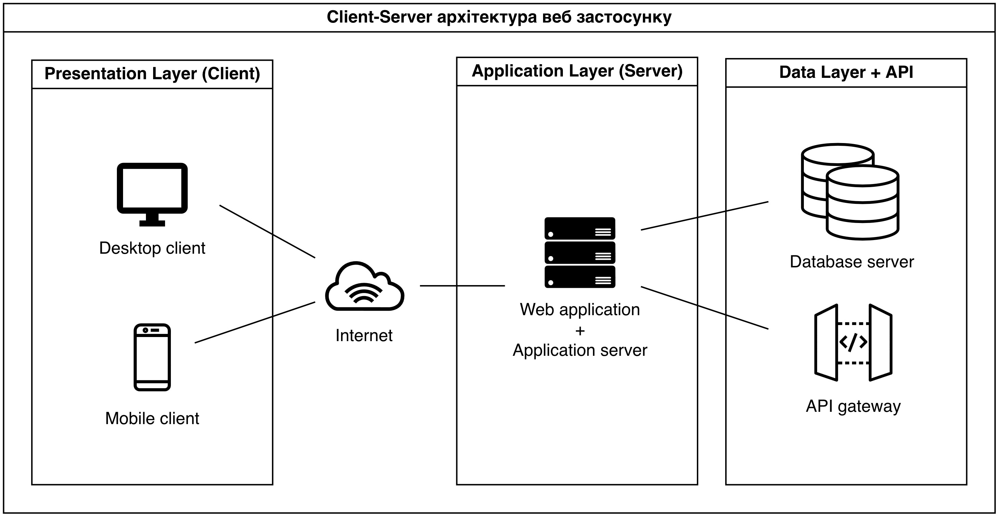

## Architecture

Проєкт реалізовано як WebДодаток на стеку MERN: React (FrontendWeb), Node.js + Express (BackendApi) та MongoDB (FilmDatabase). Дані про фільми та платформи перегляду отримуються через TmdbIntegrationService, який працює з TMDb API і за потреби кешує результати в локальній базі.

Деталі по компонентах та відповідальностях:
- [Components](docs/architecture/components.md)
- [Ownership](docs/architecture/ownership.md)
- [Data Model](docs/data_model/data_model.md)
